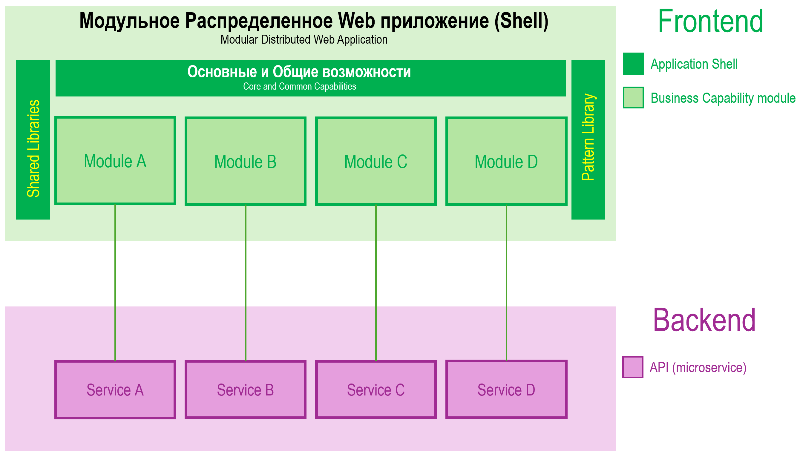

# Calabonga.Blazor.AppDefinitions

## Описание

Модульный монолит на Blazor? Легко! `Calabonga.Blazor.AppDefinitions` позволяет выделить модули (Components) в отдельные сборки (в отдельные проекты), чтобы предоставить возможность разным командам разрабатывать разные модули одного приложения. Для установки в проект достаточно установить nuget-пакет [Calabonga.Blazor.AppDefinitions](https://www.nuget.org/packages/Calabonga.Blazor.AppDefinitions/).

Помимо всего, эта сборка позволяет навести порядок в вашем `Program.cs`. Можно всё разложить "по полочкам". А еще можно реализовать систему плагинов. Чтобы воспользоваться сборкой надо просто установить nuget-пакет [Calabonga.Blazor.AppDefinitions](https://www.nuget.org/packages/Calabonga.Blazor.AppDefinitions/).

В сборку [Calabonga.Blazor.AppDefinitions](https://github.com/Calabonga/Calabonga.Blazor.AppDefinitions) входят контракты прочие необходимые для работы системы модулей артифакты.

Сборка [Calabonga.Blazor.AppDefinitions.Template](https://github.com/Calabonga/Calabonga.Blazor.AppDefinitions.Template) является шаблоном для Visual Studio (Rider), которые позволит "на лету" создать примеры модульного приложения на Blazor.

## Возможный вариант архитектуры

Используя `Calabonga.Blazor.AppDefinitions` можно с легкостью реализовать предложенную ниже архитектуру. Модули на frontend работают с микросервисами на backend. Причем, можно позволить модулям UI "ходить" в разные сервисы на стороне backend.



## Nuget-пакет

* [Calabonga.Blazor.AppDefinitions](https://www.nuget.org/packages/Calabonga.Blazor.AppDefinitions/) - nuget-пакет (этот репозиторий), который собой представляет набор контактов для использования в модулях и в основном приложении.
* [Calabonga.Blazor.AppDefinitions.Template](https://www.nuget.org/packages/Calabonga.Blazor.AppDefinitions.Template/) - nuget-пакет, установка которого добавит в список шаблонов новый шаблон `Calabonga.Blazor.Shell`. Этот шаблон создает проект Blazor Server приложения как основа для модульного монолита (Shell). Шаблон работает и для Visual Studio, и для JetBrains Rider, и для dotnet CLI.

## Видео демонстрация

На видео показано превращение обыкновенного проекта WeatherForecast на Blazor, созданное из стандартного шаблона в Visual Studio, в приложение Shell с Plugins. То есть из простого шаблона создается приложение на Blazor, которое "умеет" загружать модули.

[](https://boosty.to/calabonga/posts/b441e8df-84e1-4706-b79d-42dd5d851fd3)


## Description
 
Application Definitions for Blazor application. The small but very helpful package that can help you to organize modules in Blazor application.

## История версий

### Версия 1.2.0 2024-11-10

Обновление 1.2.0 добавило возможность сортировки модулей, а также возможность скрывать их из меню при необходимости.

* В интерфейс `IBlazorModule` добавлены новые свойства `OrderIndex` и `Visibility` (`OrderIndex` and `Visibility` properties added into `IBlazorModule` metadata interface.).
  ``` diff
      /// <summary>
      /// Module marker for Blazor application 
      /// </summary>
      public interface IBlazorModule
      {
  +       /// <summary>
  +       /// Visibility for UI. For example, NavMenu
  +       /// </summary>
  +       bool IsHidden { get; }

  +       /// <summary>
  +       /// Order index sorting operations
  +       /// </summary>
  +       int OrderIndex { get; }

          /// <summary>
          /// Module title
          /// </summary>
          string Title { get; }

          /// <summary>
          /// Brief module description
          /// </summary>
          string Description { get; }

          /// <summary>
          /// Navigation Route 
          /// </summary>
          string Route { get; }

          /// <summary>
          /// NavLink type match
          /// </summary>
          NavLinkMatch Match { get; }
      }
  ```


* Добавлен новый базовый абстрактный класс `BlazorModule`, в котором заданyые значения по умолчанию для свойств `OrderIndex` и `Visibility` (Base abstract class BlazorModule created with default values for some properties.).

### Версия 1.1.0 2024-11-08

* Добавлен сбор метаданных от модулей для возможности формировать `NavLink` динамически.
* Добавлены методы получения списка `Assembly`
* Добавления расширения для формирования ссылок для навигации.

### Версия 1.0.0 2024-11-07

* Первый релиз сборки.
